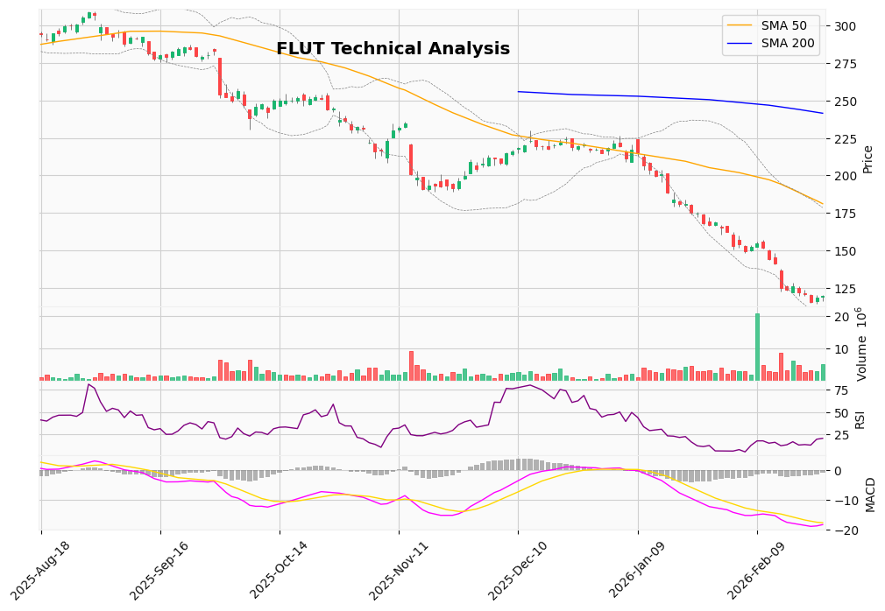

# Flutter Entertainment (FLUT): Pre-Earnings Deep Dive

> NYSE: FLUT · LSE: FLTR · Research date: **2026-02-26** (earnings day) · Price at research: **$119.84**
> Short-term trade analysis around the Q4 / FY2025 results. Not investment advice.

## 1. Price snapshot

| Metric | Value |
|---|---|
| Current price | $119.84 |
| Day change | +$0.74 (+0.62%) |
| Day range | $116.29 – $120.59 |
| 52-week high | $313.68 |
| 52-week low | $114.93 (Feb 23) |
| Decline from all-time high | −62% |
| Market cap | ~$20.21B |
| P/E ratio | −88.73 |
| Beta | 1.89 |

## 2. Earnings release: today

Flutter reports Q4 and full-year 2025 results after the close at 4:05 PM EST, with the call at 4:30 PM EST.

| Consensus estimate | Value |
|---|---|
| EPS (Q4) | $1.62 – $2.11 |
| Revenue (Q4) | ~$4.87 billion |
| Revenue growth YoY | +31% |
| Full-year 2025 revenue | ~$12.32 billion |
| Full-year 2025 EPS | ~$0.94 |
| FY2025 adj. EBITDA guidance | $3.295 billion (+40% YoY) |

## 3. Technical picture: deeply oversold

| Indicator | Value | Signal |
|---|---|---|
| RSI (14) | 20.29 | Extremely oversold |
| MACD | −18.33 | Bearish |
| MACD signal | −17.68 | — |
| MACD histogram | −0.651 | Negative |
| SMA 20 | $141.80 | Price 15% below |
| SMA 50 | $181.17 | Price 34% below |
| SMA 200 | $241.48 | Price 50% below |
| Bollinger upper / middle / lower | $178.57 / $141.80 / $105.03 | Near lower band |
| **Overall** | — | **Hold** |

RSI near 20 is far below the usual 30 threshold, and the stock has been oversold for most of the past month, which raises the odds of a mean-reversion bounce. MACD is still deeply negative with no bullish crossover, and price sits below every major moving average, so the downtrend is intact.

**News sentiment** is flat: average polarity 0.05 (neutral), subjectivity 0.21 (mostly factual). Headlines mix "plummeting" with "buying opportunity".

## 4. Why the stock was crushed

1. **UK tax hike.** iGaming duty rises from 21% to 40%. Flutter estimates a $320M EBITDA headwind in 2026 in one of its most profitable markets.
2. **US tax on gambling losses.** The OBBBA (effective January 2026) caps loss deductions at 90% of winnings, which hurts high-volume and professional bettors and reduces handle.
3. **Sector contagion.** DraftKings' weak 2026 guidance dragged the whole sector down, even though FanDuel holds 47% US share.

## 5. Earnings reaction pattern

**Warning:** Flutter has tended to fall after earnings even when it beats.

| Quarter | EPS est. | EPS actual | Beat / miss | Stock move |
|---|---|---|---|---|
| Q4 2024 | $1.83 | $2.94 | +61% beat | +1% |
| Q1 2025 | $1.89 | $1.59 | −16% miss | 0% |
| Q2 2025 | $2.19 | $2.95 | +35% beat | −8% |
| Q3 2025 | $0.39 | $1.64 | +321% beat | −14% |

In 3 of the last 4 quarters, big beats produced flat or negative moves. The market is trading forward guidance (taxes, growth), not past results.

## 6. Analyst view

| Metric | Value |
|---|---|
| Consensus | Strong Buy (22 analysts): 45% Strong Buy, 36% Buy, 18% Hold, 0% Sell |
| Average 12-month target | $281.45 (+135%) |
| Lowest / highest target | $200 (+67%) / $380 (+217%) |

Notable actions: Texas Capital upgraded to Strong Buy; Canaccord $270 Buy; Bank of America $210 Neutral (cut from $250).

**Bull catalysts:** FanDuel's 47% US share; international diversification (UK, Italy, Australia); FanDuel Predict targeting states without legal sports betting; 21% international revenue growth; a TIKR model value of ~$436/share.

## 7. Short-term probabilities

| Scenario | Probability | Trigger |
|---|---|---|
| A: Bounce (+5% to +15%) | ~40% | Beat **and** reassuring 2026 guidance on taxes |
| B: Further decline (−5% to −15%) | ~45% | Weak guidance, even with a beat |
| C: Big move (>15% either way) | ~15% | Major surprise in results or guidance |

**For buying today:** RSI ~20 is historically extreme; the stock bounced off a fresh 52-week low; analysts see 135%+ upside; revenue still growing ~31%; a relief rally could be sharp.

**Against buying today:** the post-earnings selloff pattern; results come after the close, so there's no same-day exit; tax headwinds are structural; MACD deeply bearish; beta 1.89; pre-market gap risk.

## 8. Strategic options

1. **Buy before earnings.** Highest risk and reward; exposed to a gap-down if guidance disappoints.
2. **Wait for the after-hours reaction and buy pre-market.** You may miss part of a rally but avoid the worst gap-down. Suggested for most traders.
3. **Wait for the dust to settle.** Look for an entry later in the week; support may sit around $105–$115 (lower Bollinger band to the 52-week low).

*Sources: Yahoo Finance, Benzinga, TIKR, MarketBeat, StockAnalysis, GlobeNewsWire, Simply Wall St.*
